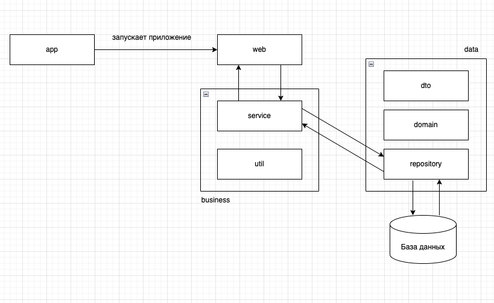

# Архитектура приложения

# Модули

## app

Здесь происходит сборка проекта в единый jar, подключается web модуль и содержится main класс

## business

Уровень бизнесс логики приложения. Содержит 2 подмодуля: **service** и **util**

### service:
Содержит логику, промежуточный уровень между controller и repository

### util:
Вспомогательные классы для различных целей

## web

Обрабатывает входящие http запросы, содержит controller

## data

Состоит из трех модулей: **dto**, **domain**, **repository**, нужен для работы с базой данных и обработкой сущностей

### dto:

Состоит из сущностей типа Data Transfer Object

### domain:

Хранилище сущностей приложения

### repository:

Классы, для работой с базой данных

## jss

Рут-модуль, в нем хранятся все остальные модули

# Блоки задач

* Работа с базой данных
* * Определить механизм работы с бд(хибернейт/темплейт)
* * Создать структуру таблиц
* * Определить модели и их поведение. Написать классы
* Работа с основной частью приложения
* * Создать репозитории
* * Создать уровень бизнесс логики в виде сервисов
* * Создать контроллеры, которые будут обрабатывать http запросы
* Работа с дополнительными технологиями
* * Подключение и настройка Spring security
* Тестирование
* * Создать модульные и интеграционные тесты
