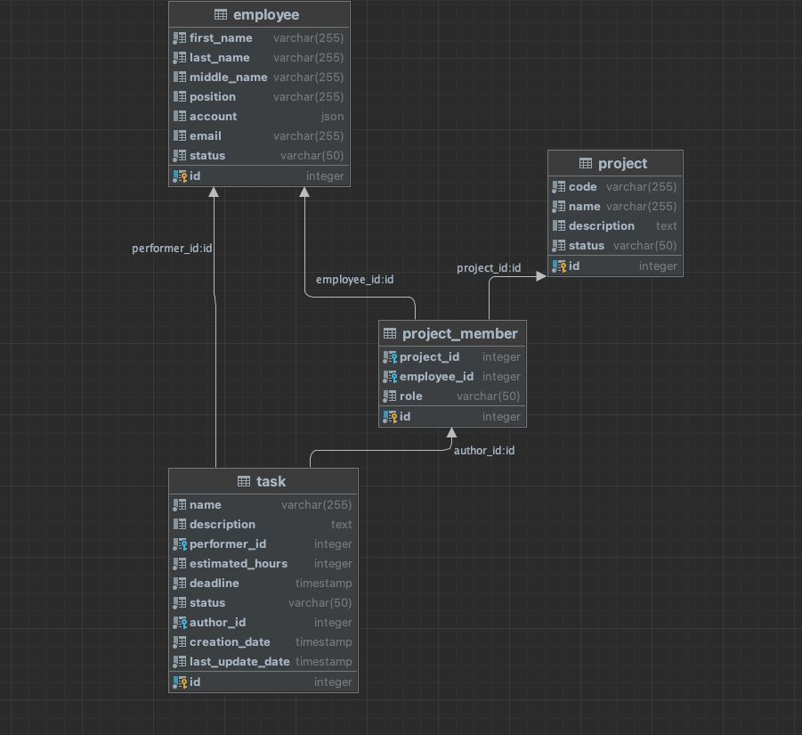

# Таблицы

## employee

Таблица всех сотрудников.

* id - primary key, обеспечивает уникальность
* first_name - имя. **not null**
* last_name - фамилия. **not null**
* middle_name - отчество. **nullable**
* position - должность. **nullable**
* account - пока затычка в виде json,
  позже поменяю на объект для учетной записи. **nullable**
* email - мыло. **nullable**
* status - одно из двух значений: активный\удаленный.
  Можно было бы создать собственный тип,
  но на лекции говорили так не делать. **not null**

## project

Таблица всех проектов.

* id - primary key, обеспечивает уникальность
* code - уникальное имя проекта. **not null**, **unique**
* name - короткое наименование проекта. **not null**
* description - описание проекта. **nullable**
* status - одно из значений: черновик\в разработке\в тестировании\завершен.
  **not null**

## project_member

Таблица отношений между сотрудниками и проектами. M2M.

* id - primary key, обеспечивает уникальность
* project_id - id проекта, связанного с сотрудником. **not null**
* employee_id - id работника, связанного с проектом. **not null**
* role - одно из значений: руководитель проекта\аналитик\разработчик\тестировщик.
  **not null**

## task

Таблица всех задач.

* id - primary key, обеспечивает уникальность
* name - наименование задачи. **not null**
* description - описание задачи. **nullable**
* performer_id - id сотрудника, выполняющего задачу. **not null**
* estimated_hours - оценка в часах, необходимая для выполнения работы. **not null**
* deadline - дедлайн. **not null**
* status - одно из значений: новая\в работе\выполнена\закрыта. **not null**
* author_id - id участника команды проекта, который является автором задачи. **not null**
* creation_date - дата создания. **not null**
* last_update_date - дата последнего измнения. **not null**
